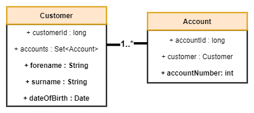

Know Your Customer
==================

## Java Technical Test

Within the banking industry we need to validate customer details against source systems to ensure a customer is who they say they are.
For administrators, we would require lookups to validate customer details. We might also need to validate that front-end input matches back-end business logic.
Using Spring Boot and a database technology of your choice, create a new RESTful API with end points to carry out the following functions:

### Step One

*Figure 1 - All fields marked in bold are mandatory*

Please add the missing fields to the project assuming that the
entities will only ever be called within the application and any
access to the system is don’t through the data transfer object.

Validation for ensuring all fields in bold will assume that we only
need the fields to be not null.

### Step Two

Update the existing endpoints with new endpoints for the following scenarios:

- Add a new account
    - Post mapping, accepting through account DTO and a new service layer to map the DTO to an entity. 
    - Then persist this entity to the database
    - Return the persisted entity back to the user with a sensible http response code
- Add a new customer
    - Post mapping, accepting through customer DTO and a new service layer to map the DTO to an entity. 
    - Then persist this entity to the database 
    - Return the persisted entity back to the user with a sensible http response code

When you are finished, upload your source code to GitHub and
send a link to the following email addresses.
- amb@phoebussoftware.com
- pss@phoebussoftware.com
- mb@phoebussoftware.com

Note: this is not a timed test, but it is expected to take around 2-8 hours to complete
depending on your experience with the spring framework.
We respect your time so please do as much as you can in the time allowed;
please don’t aim for perfection but please do finish with a
runnable project / docker image to a production ready standard.

### Notes

You can view the swagger ui at: http://localhost:8080/swagger-ui/index.html?configUrl=/v3/api-docs/swagger-config
